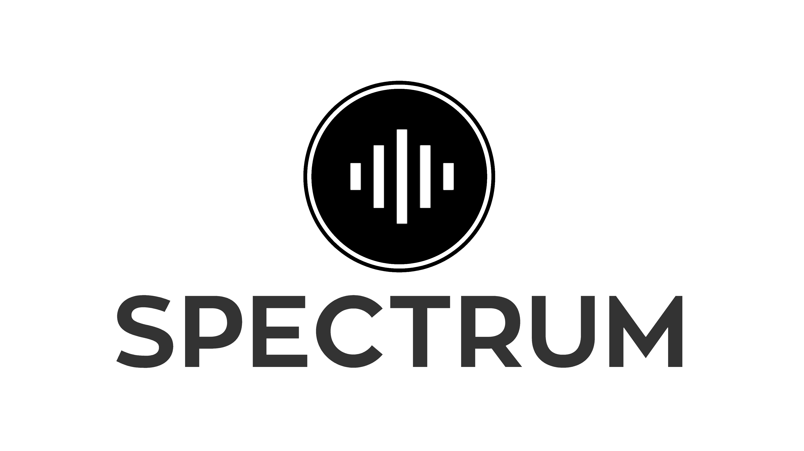

 

  

## About

<ul>
  <li>
    Empowering Inclusive Conversations  
  </li>
</ul>

Summary:
Designed to facilitate inclusive and accessible communication for individuals with disabilities. Serves as a versatile chat board that promotes a supportive environment for users of all abilities. Aims to break down barriers and foster meaningful connections within the disability community and beyond.
